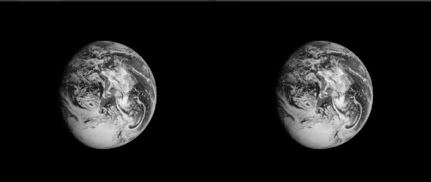
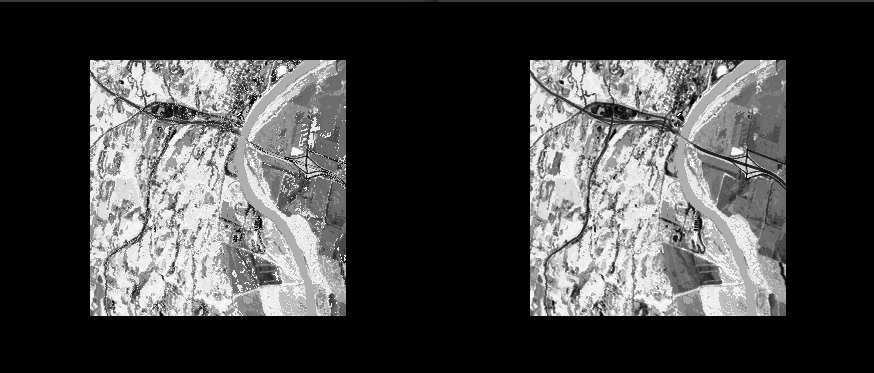

# Huffman Compression Algorithm for Greyscale Images
The project's main aim is to compress greyscale images into uniquely decodable text files containing information about the aforemnetioned greyscale image that can be later restorted into .pgn images.

## Table of contents
* [General info](#general-info)
* [Screenshots](#screenshots)
* [Setup](#setup)
* [Features](#features)
* [Status](#status)
* [Contact](#contact)

## General info
Huffman Coding is an algorithm for doing data compression.We will use variable-length encoding so we can exploit the fact that some characters occur more frequently than others in the file we would like to compress, thus we can design an algorithm which can represent the same piece of text using a lower number of bits. In our case, we will be dealing with greyscale values arranged in an array which represent the intensity of white color in a pixel. 

## Screenshots




Pre-compression image is on the right, post-compression image is on the left. Some quality degeraditon occurs. We unfortunately could not find a fix for this.

## Setup
```
make
```

```
./run -encode [omaha] < ./data/[omaha.pgm]
```

```
./run -decode [omaha]
```

## Methodolgy

The technique works by creating a binary tree of nodes. A node can be either a leaf node or an internal node. Initially, all nodes are leaf nodes, which contain the character itself, the frequency the character. Internal nodes contain character weight and links to two child nodes. For our implementation, bit ‘0’ represents tracing the left child and bit ‘1’ represents tracing the right child. A finished tree has n leaf nodes and n-1 internal nodes.

We have utilized the <bits/stdc++.h> header to define types that you can use when you need an exact number of bits, with or without the sign. It's handy when we do computations on bits, or on specific range of values (in our case; grey scale values ranging from 0 to 255 in our image processing algorithm for example) because we don't have to determine the size of a long, or an unsigned int, we simpy use what we need.

> MORE TO BE ADDED

## Features
List of features ready and TODOs for future development
* Code is capable of loseless compression of greyscale images.
* Text files can be futher compressed via other means to provide higher compression rates.

To-do list:
* Conversion of text files into binary code for further loseless compression of images.
* Improving input/out method. 

## Status
Project is: _finished_

## Contact
Created by Nada Ashraf, Khaled Maher, Ali Gamal, Sondos Mohammad, Samar Ibrahim. (Team 12 - SBE 2021)
